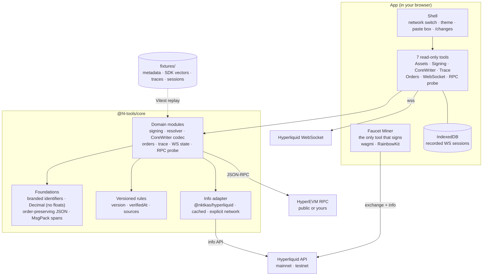

# hl-tools

**Understand and verify any Hyperliquid action.** Diagnostic tools for developers building on HyperCore and HyperEVM, live at [hltools.tech](https://hltools.tech).

Every tool is read-only, works without a wallet and runs in your browser. Pasted payloads and signatures are processed client-side and never put into a URL unless you explicitly share them. Every fetched result shows the network it came from and when it was observed, and identifiers never silently cross between mainnet and testnet.

All tools share one typed, decimal-safe protocol core, [`@hl-tools/core`](packages/hl-core). Its signing is checked byte for byte against the official Python SDK.

## Tools

| Tool | Answers | Route |
|---|---|---|
| **Asset Resolver** | *Why does `@107` mean HYPE on mainnet but nothing on testnet?* Says what you typed (`@` spot index, `#` outcome coin, `+` outcome token, `dex:` HIP-3, bare asset ID…), then every spelling of each identity with where it is used (info/WS coin, exchange `a`, token for balances and transfers, app-only display symbol), the same asset on other venues, and settled HIP-4 outcomes that have left `outcomeMeta`. Side by side across networks; ambiguous queries are never auto-resolved. | `/tools/assets` |
| **Signing Inspector** | *`L1 error: User or API Wallet 0x… does not exist.`* Shows the signing family, canonical MsgPack bytes, action hash, EIP-712 typed data and the recovered signer. Compare mode names the first divergent byte between two payloads. No private-key field. | `/tools/signing` |
| **CoreWriter Workbench** | *What does `0x01000001…` actually tell HyperCore to do?* Decodes or builds raw CoreWriter action bytes, with raw integers next to human units. Generates `cast` and Solidity, and queries all 19 read precompiles live. | `/tools/corewriter` |
| **Cross-layer Trace** (flagship) | *My EVM transaction succeeded — why did nothing happen on HyperCore?* Follows a HyperEVM transaction through its receipt and decoded CoreWriter actions to the expected and the observed HyperCore effect, and checks every EVM → Core token transfer (e.g. a `CoreDepositWallet.depositFor` payout) against the recipient's HyperCore ledger, so a silently dropped transfer is reported as such. Each link is labelled observed, inferred or unknown. | `/tools/trace` |
| **Order Composer & Failure Explainer** | *`Price must be divisible by tick size.`* Composes order payloads from intent, with a pre-flight tick/lot linter that blocks instead of silently rounding. Explains exchange responses status by status. | `/tools/orders` |
| **WebSocket Workbench** | *Did I miss messages while my socket was down?* Shows the subscription ack, snapshot and live stream with freshness. Simulates a disconnect and diffs state across the reconnect. Records bounded, sanitised sessions and replays them. | `/tools/websocket` |
| **RPC Capability Probe** | *Does this RPC return historical state or silently give me latest?* Checks chain ID, head freshness and historical state (with exact controls), plus `eth_getLogs` range limits and HyperEVM-specific methods, with a two-endpoint comparison. | `/tools/rpc` |
| **Testnet Faucet Miner** | *How do I get more than one faucet drip of testnet USDC?* The original hl-tools utility, and the only tool that signs and sends: it chains generated wallets through the testnet faucet using your connected wallet. [How it works](https://hltools.tech/faucet-miner/how-to-use). | `/faucet-miner` |

Each tool page shows the date its rules were last verified against the protocol docs and links its primary source. [`/changes`](https://hltools.tech/changes) lists every versioned rule set with its sources and changelog.

## Architecture



- **`packages/hl-core`** holds the protocol logic, with no React and no DOM. Its versioned rules also drive the "last verified" dates on tool pages and the `/changes` page. Network access is injected, so traces, probes and sessions replay from recorded fixtures in tests.
- **`src/`** is the app: file-based routes in `src/routes/`, tool UIs in `src/components/tools/`, and the shared design system in `src/components/hub/`.
- Why things are built the way they are: [DECISIONS.md](DECISIONS.md). What was tested, with which inputs, plus screenshots of every page: [TESTING.md](TESTING.md).

## Run it

Requires [Bun](https://bun.sh) (or Node 22+ for the production server).

```bash
git clone https://github.com/ashwinarora/hl-tools.git
cd hl-tools
bun install
bun --bun run dev        # http://localhost:3000
```

The diagnostic tools need no configuration. The faucet miner's WalletConnect option needs a project ID in `.env` (from [cloud.walletconnect.com](https://cloud.walletconnect.com/)):

```
VITE_WALLETCONNECT_PROJECT_ID=your_walletconnect_project_id
```

| Command | What it does |
|---|---|
| `bun --bun run dev` | Dev server on port 3000 |
| `bun --bun run build` | Production build into `.output/` |
| `bun --bun run start` | Serve the production build (`node .output/server/index.mjs`) |
| `bun --bun run test` | Vitest: protocol core (277 tests) |
| `bun --bun run check` | Biome lint + format check |

Dev-only helpers: `?devtools=1` shows the TanStack devtools, and `/faucet-miner?mock=1` runs the faucet miner against an MSW mock of the Hyperliquid API, so no funds move.

## Contributing fixtures

Every bug found in a browser should become a fixture, so the core never regresses on it. Fixtures live in [`packages/hl-core/fixtures/`](packages/hl-core/fixtures). Most are data-only, and a new case is picked up by the existing tests.

| Fixture | Add a case when… | Format |
|---|---|---|
| `resolver/cases.json` | a query resolves wrongly or explains badly | `{ network, query, first, ambiguous, includes, matches, noteIncludes, expect, bug? }`, resolved against `metadata/<network>.json` |
| `orders/lint-cases.json` | a price/size is accepted, rejected or rounded wrongly | `{ coin, input, valid, wire, options, note }` under `price` / `size` |
| `orders/explain-cases.json` | an exchange response or error is explained wrongly | `{ name, input, request?, kind, outcomes, bug? }` |
| `corewriter/cases.json` | CoreWriter bytes decode wrongly | `{ name, network, hex, kind, action, fields, issueCodes }` (real payloads preferred) |
| `signing/python-sdk-vectors.json` | a signing case isn't covered | regenerate with `scripts/gen_signing_vectors.py` from a checkout of `hyperliquid-python-sdk`; never hand-edit |
| `trace/<name>.json` | a transaction traces wrongly | `bun packages/hl-core/scripts/record_trace.ts <name> <network> <txHash>`, then add an assertion in `test/corewriter.test.ts` |
| `ws/<name>.json` | WebSocket state handling is wrong | `bun packages/hl-core/scripts/record_ws.ts <name> <network> <seconds> '<subscription json>'` |
| `metadata/<network>.json` | the resolver needs newer metadata | `python3 packages/hl-core/scripts/snapshot_metadata.py` (then re-run the tests; update cases that legitimately changed) |

Then run `bun --bun run test` and `bun --bun run check`. If a rule changed (a limit, a unit, an error string), bump its rule set's `version` and `verifiedAt` in `packages/hl-core/src/rules/` and add a changelog entry. `/changes` picks it up automatically.

## Stack

TanStack Start (React 19, SSR, Nitro) · TanStack Router and Query · Zustand · Tailwind CSS v4 with shadcn/ui primitives · viem · `@nktkas/hyperliquid` · wagmi and RainbowKit (faucet miner only) · Vitest · Biome · TypeScript strict.

## Disclaimer

Independent open-source project, not affiliated with Hyperliquid. The diagnostic tools are read-only. The faucet miner sends funds directly to Hyperliquid on your behalf from your own wallet; use it at your own discretion.

## License

MIT
